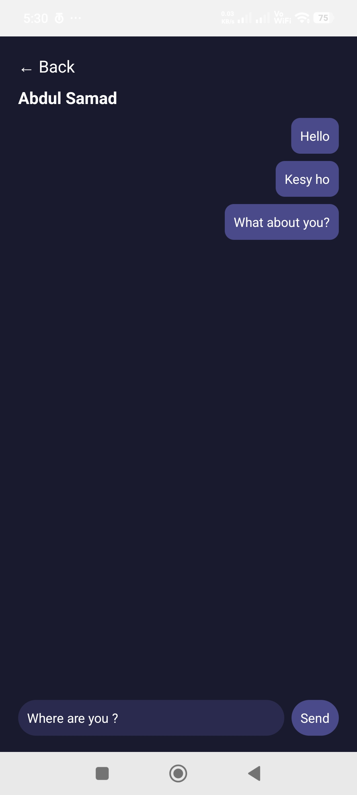

# ChatApp

A simple mobile chat application built with React Native, TypeScript, and Supabase.

## About the App

I built this app to practice building a chat application with React Native and working with Supabase.

The app has a chat list where users can select a person and open a conversation. Inside the chat screen, users can type and send messages.

## Features

* Chat list
* Individual chat screen
* Send messages
* Message input
* Back navigation
* Multiple conversations
* Dark UI

## Tech Used

* React Native
* TypeScript
* Supabase

## Screenshots

### Chats Screen

This screen shows the list of available chats. Users can select a chat to open the conversation.


### Chat Screen

This screen shows an individual conversation where users can view messages and send new messages.



## Getting Started

### Requirements

* Node.js
* Android Studio
* Android SDK
* React Native development environment

### Installation

Clone the repository:

```bash
git clone https://github.com/samadafrid1018/ChatApp.git
```

Go to the project folder:

```bash
cd ChatApp
```

Install the packages:

```bash
npm install
```

Start Metro:

```bash
npx react-native start
```

Run the app on Android:

```bash
npx react-native run-android
```

## Project

This project was built as a React Native practice project to improve my experience with mobile UI, navigation, TypeScript, and Supabase.

## Developer

Abdul Samad

React Native Developer
